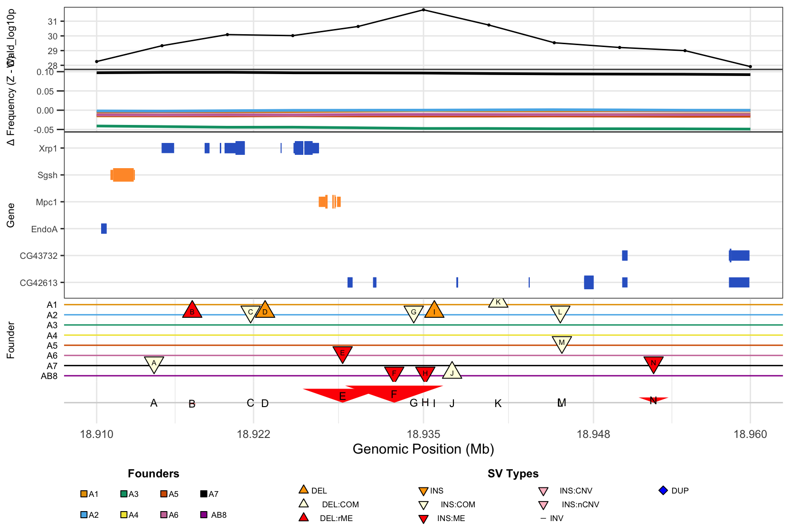

# XQTL2.Xplore Repository

This repository contains the XQTL2.Xplore R package for XQTL (Experimental Quantitative Trait Locus) analysis and visualization.

## Package Overview

XQTL2.Xplore provides comprehensive tools for:
- **Genome-wide QTL visualization** with Manhattan plots
- **Regional analysis** with peak refinement tools
- **Frequency change analysis** across experimental conditions
- **Gene and variant annotation** visualization
- **Publication-ready multi-panel plots**

## Quick Installation

### Method 1: Install from GitHub (Recommended)
```r
# Install remotes if not already installed
if (!requireNamespace("remotes", quietly = TRUE)) {
  install.packages("remotes")
}

# Install the package
remotes::install_github("tdlong/XQTL2.Xplore")

# Load and test
library(XQTL2.Xplore)
```

### Method 2: Install from local source
```r
# Clone the repository first, then:
# In R, set working directory to the package folder
setwd("path/to/XQTL2.Xplore")

# Install devtools if needed
if (!requireNamespace("devtools", quietly = TRUE)) {
  install.packages("devtools")
}

# Install the package
devtools::install()
```

## Test Installation

After installation, test that everything works:

```r
# Load the package
library(XQTL2.Xplore)

# Check available data
data(package = "XQTL2.Xplore")

# Load and examine example data
data(zinc_hanson_pseudoscan)
data(zinc_hanson_means)
data(dm6.ncbiRefSeq.genes)
data(dm6.variants)

# Quick test - should work without errors
head(zinc_hanson_pseudoscan)
```

## Demo

**Quick Context:** [Example study](https://academic.oup.com/genetics/article/231/3/iyaf173/8239421)

X-QTL mapping of multiparental Drosophila population to identify genomic loci associated with zinc toxicity resistance. This identified 10 genes with significant genotype-by-treatment effects, including pHCl-2, which encodes a zinc sensor protein. This provides a pathway to a broader understanding of the biological impact of metal toxicity.

**Test the core functionality:**

```r
# Load the package and data
library(XQTL2.Xplore)
data(zinc_hanson_pseudoscan)
data(zinc_hanson_means)
data(dm6.ncbiRefSeq.genes)
data(dm6.variants)

# Find a peak in a genomic region
out <- XQTL_zoom(zinc_hanson_pseudoscan, "chr3R", 18000000, 20000000, 3, 3)

# View the zoomed region
print(out$plot)

# Create a publication-ready 5-panel plot
XQTL_5panel_plot(zinc_hanson_pseudoscan, zinc_hanson_means, 
                 dm6.variants, dm6.ncbiRefSeq.genes, 
                 out$chr, out$start, out$stop)
                 
#More zoomed in?
XQTL_5panel_plot(df1, df2, dm6_variants, dm6_genes,
                 chr = "chr2L",
                 start = 18930000,
                 stop  = 18940000)
```
**Expected output:**



**Description:**
1. **Top panel (Wald_log10p):**
- This is a line graph showing how statistically significant the genetic association is at each position along a genomic region. The y-axis shows the Wald -log10(p-value), which tests for no difference between founder allele frequencies at each position — larger values (values above 10) mean stronger evidence for a QTL at that location.
- In this study, the signal peaks around 32 near 18.935 Mb, an exceptionally strong result indicating high-confidence evidence for a zinc resistance QTL in this region.

2. **Second panel (Frequency(Z-C):**
- This panel shows the change in frequency for each founder's alleles between zinc-selected and control conditions. Positive values mean a founder's alleles increased in frequency under zinc selection (suggesting zinc resistance), while negative values indicate a decrease (suggesting zinc sensitivity).
- In this study, the black line (founder A7) rises above zero, meaning A7 alleles became more common under zinc stress and appear to confer protection. The green line (founder A3) drops below zero, indicating A3 alleles were selected against and that founder is sensitive to zinc.

3. **Third panel (Gene tracks):**
- This panel is a gene track showing the exon structure of candidate genes in the region. Blue rectangles represent exons in genes transcribed left to right (5' to 3'), while orange rectangles represent genes on the reverse strand (3' to 5'). Within each gene, thicker rectangles are coding exons and thinner ones are 5' or 3' UTRs.
- The genes shown — Xrp1, Sgsh, Mpc1, EndoA, CG43732, and CG42613 — sit underneath the QTL peak and are therefore candidate contributors to zinc resistance. Their exon structures are shown to help identify which parts of each gene might be disrupted by nearby structural variants.

4. **Fourth panel (Structural Variants by Founder):**
- This panel shows structural variants (SVs) carried by each of the 8 founders across the region. Each horizontal colored line represents one founder, using the same color scheme as Panel 2. Symbols along the lines indicate individual SV events, with shape and color encoding the SV type — upward triangles are deletions, downward triangles are insertions, red filled symbols indicate mobile element variants, and so on. Triangle size is constant and does not reflect variant size. Each SV event is assigned a letter label.

5. **Fifth panel (Structural Variants to Scale):
- This bottom track shows the same lettered SV events from Panel 4, but now drawn to scale so that physically larger variants appear as larger shapes. This makes it possible to visually compare variant sizes across founders. The large red arrows labeled E and F near 18.930–18.938 Mb stand out as particularly large mobile element variants present in founders A5, A7, and AB8, making them notable candidates for functional investigation.

## Documentation & Learning

### Vignettes (Interactive Tutorials)

```r
# setwd("path to where XQTL2.Xplore is located on your device") 

# Load specific vignettes
file.edit("XQTL2.Xplore/vignettes/XQTL2_workflow.Rmd")
file.edit("XQTL2.Xplore/vignettes/XQTL2_usage.Rmd")
```

### What You'll Learn in the Vignettes:

** XQTL2_workflow **: Complete analysis workflow from genome-wide exploration to detailed peak analysis
- Step-by-step QTL analysis process
- Peak refinement techniques
- Publication-ready multi-panel plots
- Real data examples throughout

** XQTL2_usage**: Comprehensive function reference with examples
- All plotting functions demonstrated
- Data format requirements
- Customization options
- Advanced usage patterns

### Key Functions Demonstrated in Vignettes:
- **`XQTL_Manhattan_5panel()`** - Genome-wide QTL visualization
- **`XQTL_zoom()`** - Peak detection and regional analysis
- **`XQTL_5panel_plot()`** - Publication-ready multi-panel plots
- **`XQTL_genes()`** - Gene annotation visualization
- **`XQTL_variantsByFounder()`** - Variant analysis across founders
- **`XQTL_change_average()`** - Frequency change analysis

## Key Features

- **Example datasets** included for immediate use
- **Comprehensive vignettes** with complete workflows
- **Publication-ready plots** with customizable themes
- **Efficient data processing** for large genomic datasets
- **Multiple visualization options** for different analysis stages

## System Requirements

- R version 3.5 or higher
- **Minimal dependencies**: Only essential packages required
- **Optional**: Bioconductor packages only needed for custom data preparation
- RStudio (recommended) or R console

## License

This project is licensed under the MIT License - see the [LICENSE](LICENSE) file for details.

## Contributing

Contributions are welcome! Please feel free to submit a Pull Request.

## Support

- Check the [vignettes](vignettes/) for usage examples
- Review the [installation guide](INSTALL.md) for troubleshooting
- Open an issue on GitHub for bug reports or feature requests

## Citation

If you use this package in your research, please cite:

```
XQTL2.Xplore: An R package for XQTL analysis and visualization
Author: Tony Long
Version: 0.0.0.9000
URL: https://github.com/tdlong/XQTL2.Xplore
``` 
