# XQTL2: A Complete Workflow for XQTL Analysis

## Introduction

This vignette demonstrates a complete workflow for XQTL (Experimental
Quantitative Trait Locus) analysis using the XQTL2 package. We’ll walk
through the typical analysis steps from initial data exploration to
detailed peak examination using example datasets from the ZINC Hanson
experiment.

## Loading the Package and Data

First, let’s load the XQTL2 package and the example datasets:

``` r
library(XQTL2.Xplore)

# Load example datasets
data(zinc_hanson_pseudoscan)  # QTL scan results
data(zinc_hanson_means)       # Founder frequency data

# Load reference data for genes and variants
data(dm6.ncbiRefSeq.genes)    # Gene annotations
data(dm6.variants)           # Variant data

# Display basic information about the datasets
cat("ZINC Hanson pseudoscan data dimensions:", dim(zinc_hanson_pseudoscan), "\n")
#> ZINC Hanson pseudoscan data dimensions: 25977 8
cat("ZINC Hanson means data dimensions:", dim(zinc_hanson_means), "\n")
#> ZINC Hanson means data dimensions: 3987264 6
cat("Available chromosomes:", unique(zinc_hanson_pseudoscan$chr), "\n")
#> Available chromosomes: chr2L chr2R chr3L chr3R chrX
```

## Step 1: Genome-wide Visualization

### Manhattan Plots

The first step in any QTL analysis is to visualize the genome-wide
association results. XQTL2 provides several Manhattan plot options:

``` r
# 5-panel Manhattan plot with physical distance (Mb) - useful for precise peak localization
XQTL_Manhattan_5panel(zinc_hanson_pseudoscan, cM = FALSE)
#> Warning: Removed 5210 rows containing missing values or values outside the scale range
#> (`geom_point()`).
```

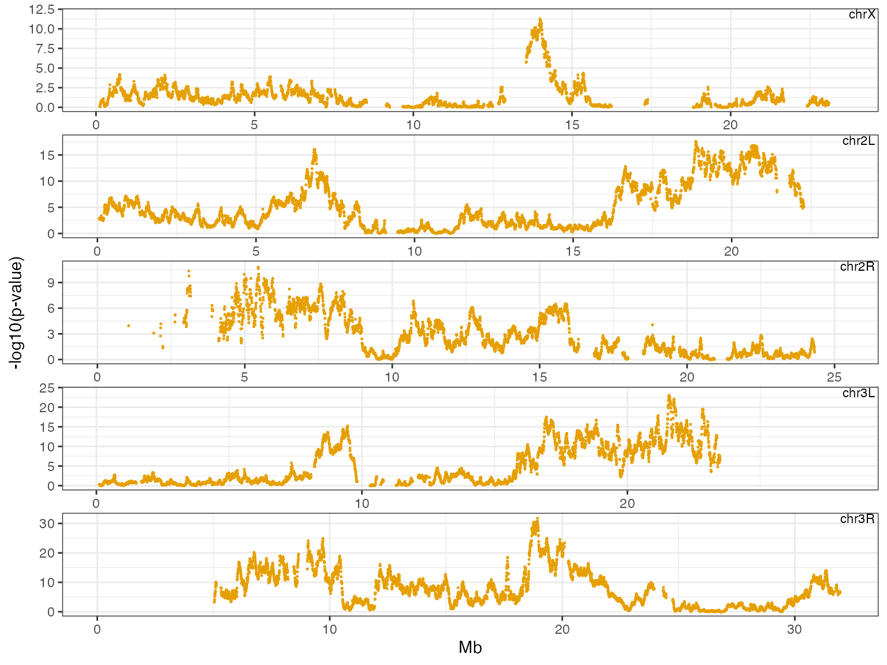

``` r

# 5-panel Manhattan plot with genetic distance (cM) - useful for broad peak identification
XQTL_Manhattan_5panel(zinc_hanson_pseudoscan, cM = TRUE)
#> Warning: Removed 5210 rows containing missing values or values outside the scale range
#> (`geom_point()`).
```

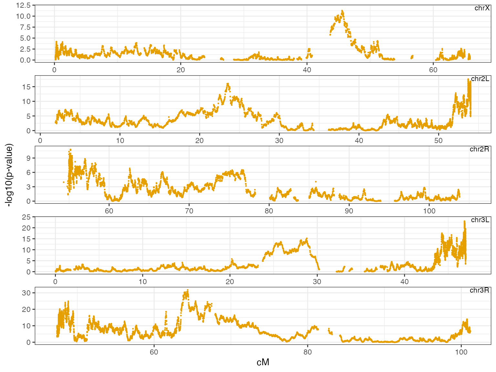

``` r

# Traditional Manhattan plot with physical distance
XQTL_Manhattan(zinc_hanson_pseudoscan, cM = FALSE, color_scheme = "UCI")
```

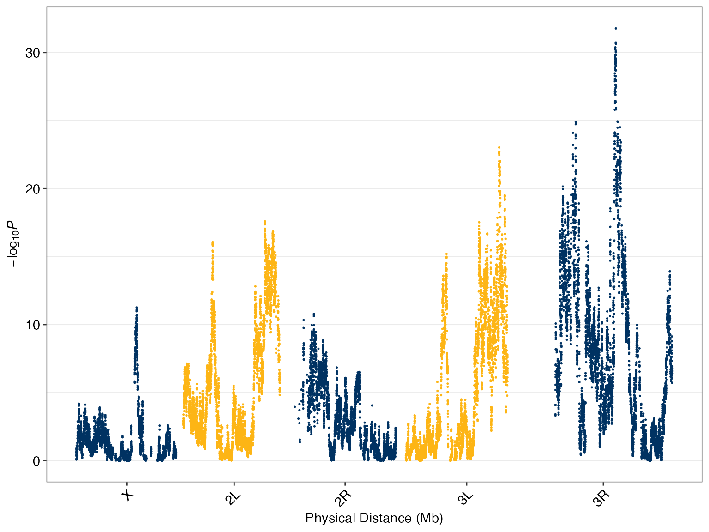

``` r

# Traditional Manhattan plot with genetic distance
XQTL_Manhattan(zinc_hanson_pseudoscan, cM = TRUE)
```

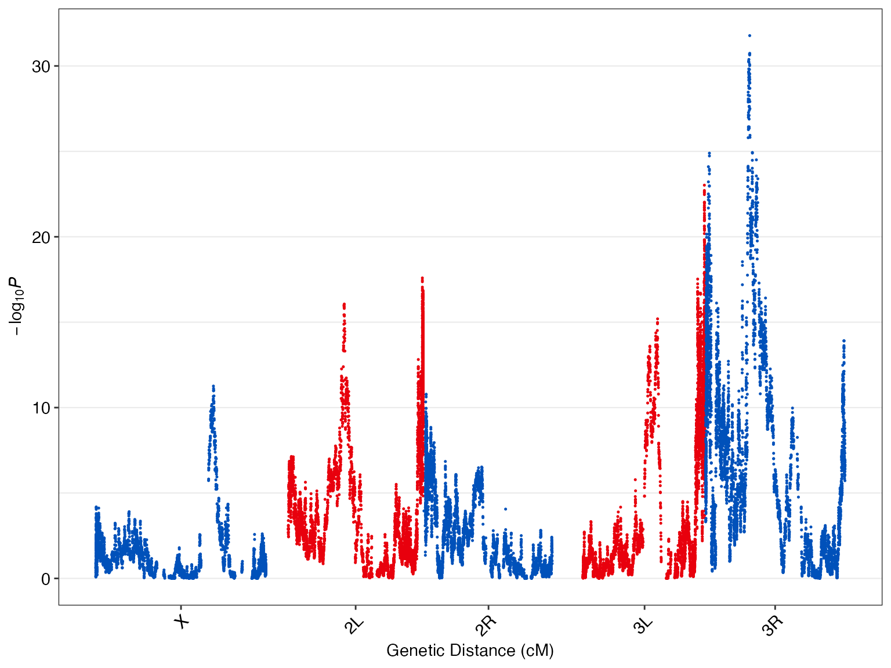

**Note**: The 5-panel Manhattan plots are particularly useful for
high-quality datasets as they allow you to estimate peak locations
within ~2Mb intervals. Genetic distance (cM) plots help identify broad
peaks in centromeric regions that may not be actionable.

## Step 2: Frequency Change Analysis

Once you’ve identified regions of interest, examine how allele
frequencies change between treatment and control conditions:

``` r
# Basic frequency change analysis
XQTL_change_average(zinc_hanson_means, "chr3R", 18000000, 20000000)
```

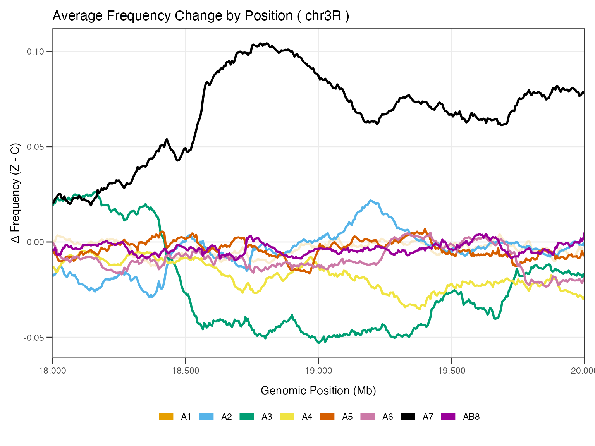

``` r

# Frequency change with reference strain highlighting
XQTL_change_average(zinc_hanson_means, "chr3R", 18000000, 20000000, reference_strain = "A1")
```

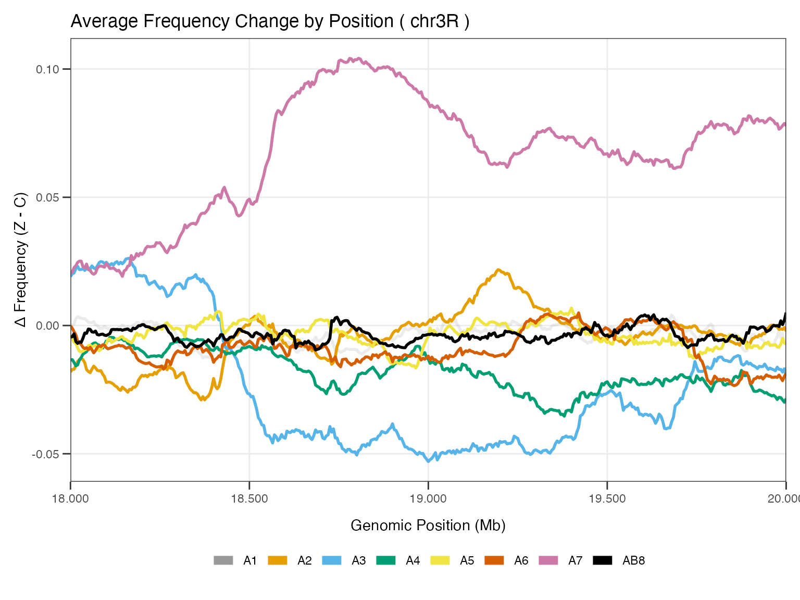

``` r

# Frequency changes by replicate
XQTL_change_byRep(zinc_hanson_means, "chr3R", 18000000, 20000000)
```

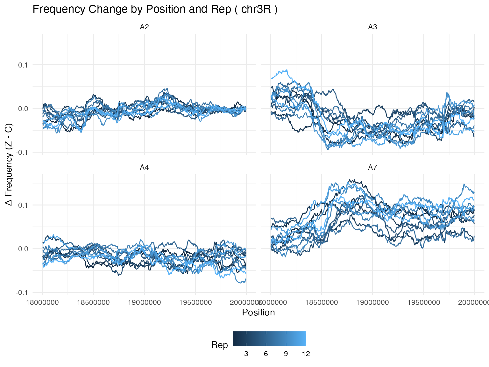

## Step 3: Peak Refinement with XQTL_zoom

The `XQTL_zoom` function is an extremely productive tool for refining
peak boundaries. It finds the maximum association score in a region and
defines interval boundaries based on specified drops in significance:

``` r
# Find and refine peak boundaries
# Arguments: data, chromosome, start, stop, left_drop, right_drop
out <- XQTL_zoom(zinc_hanson_pseudoscan, "chr3R", 18000000, 20000000, 3, 3)

# View the refined peak
out$plot
```

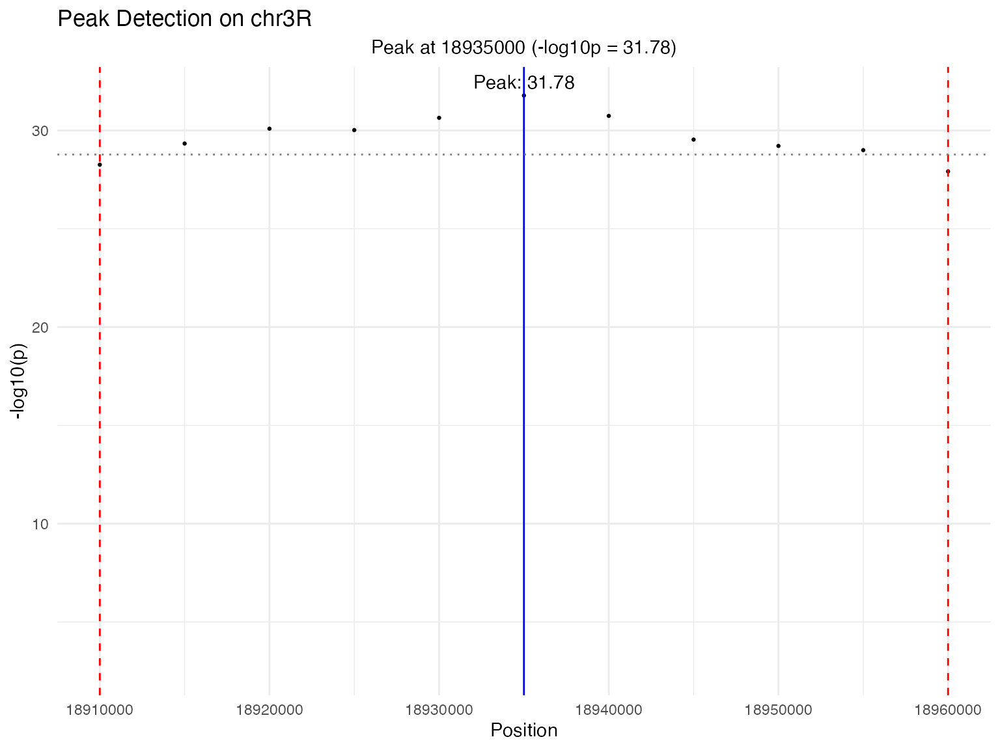

``` r

# Display the new interval boundaries
cat("Refined interval:", out$chr, ":", out$start, "-", out$stop, "\n")
#> Refined interval: chr3R : 18910000 - 18960000
```

**Tip**: Adjust the left and right drop parameters until you’re
satisfied with the peak boundaries. Smaller drops create narrower
intervals, larger drops create broader intervals.

## Step 4: Detailed Regional Analysis

With refined peak boundaries, create detailed visualizations of the
region:

``` r
# Create individual plots for the refined region
A1 <- XQTL_region(zinc_hanson_pseudoscan, out$chr, out$start, out$stop, "Wald_log10p")
A2 <- XQTL_change_average(zinc_hanson_means, out$chr, out$start, out$stop)
A2b <- XQTL_change_average(zinc_hanson_means, out$chr, out$start, out$stop, plotSelection = TRUE)
A3 <- XQTL_genes(dm6.ncbiRefSeq.genes, out$chr, out$start, out$stop)
#> Warning: Using `size` aesthetic for lines was deprecated in ggplot2 3.4.0.
#> ℹ Please use `linewidth` instead.
#> ℹ The deprecated feature was likely used in the XQTL2.Xplore package.
#>   Please report the issue to the authors.
#> This warning is displayed once per session.
#> Call `lifecycle::last_lifecycle_warnings()` to see where this warning was
#> generated.
A4 <- XQTL_variantsByFounder(dm6.variants, out$chr, out$start, out$stop, zinc_hanson_means)
A5 <- XQTL_SVBySize(dm6.variants, out$chr, out$start, out$stop, zinc_hanson_means)

# Combine plots using patchwork
library(patchwork)
A1 / A3 / A2
#> Warning: Removed 4 rows containing missing values or values outside the scale range
#> (`geom_segment()`).
```

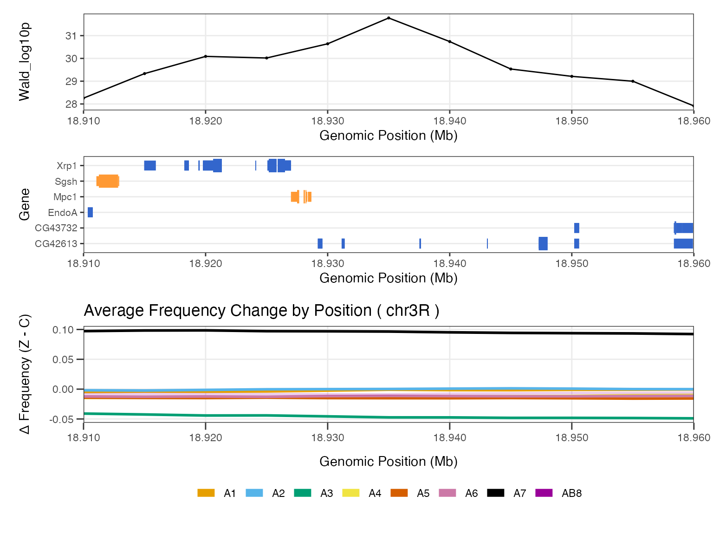

``` r
A4 / A5
```

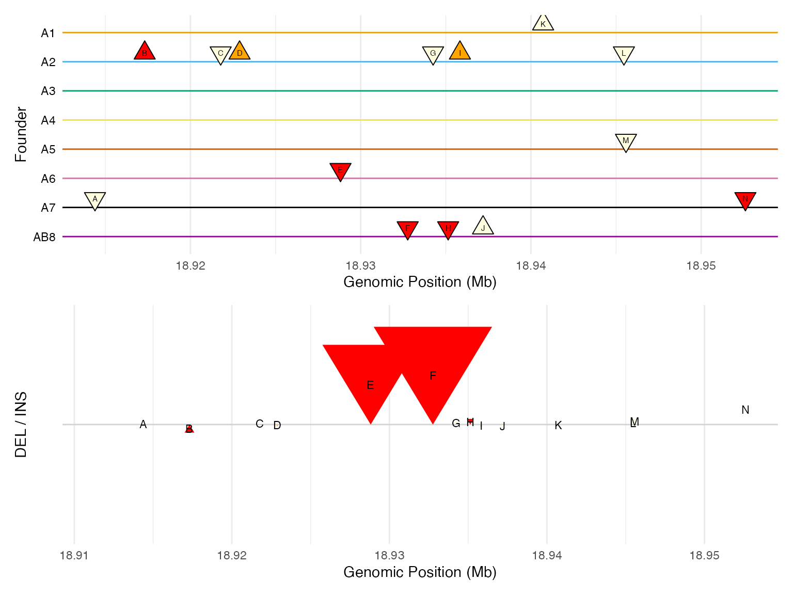

## Step 5: Publication-ready Multi-panel Plot

For publication, create a comprehensive 5-panel plot that combines all
analyses:

``` r
# Create publication-ready 5-panel plot
XQTL_5panel_plot(zinc_hanson_pseudoscan, zinc_hanson_means, 
                 dm6.variants, dm6.ncbiRefSeq.genes, 
                 out$chr, out$start, out$stop)
#> Scale for x is already present.
#> Adding another scale for x, which will replace the existing scale.
#> Scale for x is already present.
#> Adding another scale for x, which will replace the existing scale.
#> Scale for x is already present.
#> Adding another scale for x, which will replace the existing scale.
#> Scale for x is already present.
#> Adding another scale for x, which will replace the existing scale.
#> Warning: Removed 4 rows containing missing values or values outside the scale range
#> (`geom_segment()`).
```

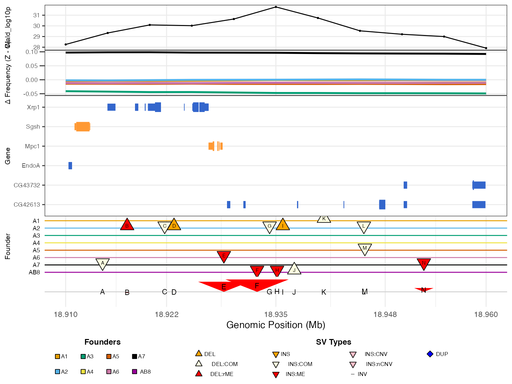

## Step 6: Exploring Additional Peaks

Let’s examine another region to demonstrate the workflow:

``` r
# Explore a peak on chromosome 2L
out2 <- XQTL_zoom(zinc_hanson_pseudoscan, "chr2L", 6000000, 7500000, 2, 2)
out2$plot
```

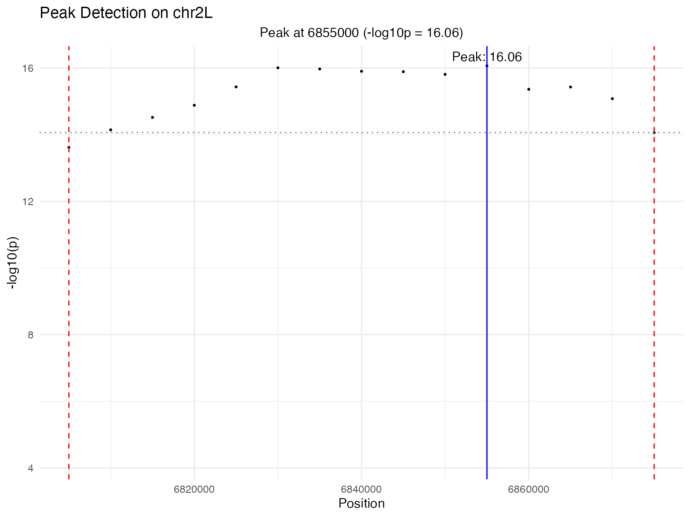

``` r

# Create multi-panel plot for this region
myplot <- XQTL_5panel_plot(zinc_hanson_pseudoscan, zinc_hanson_means, 
                           dm6.variants, dm6.ncbiRefSeq.genes, 
                           out2$chr, out2$start, out2$stop)
#> Scale for x is already present.
#> Adding another scale for x, which will replace the existing scale.
#> Scale for x is already present.
#> Adding another scale for x, which will replace the existing scale.
#> Scale for x is already present.
#> Adding another scale for x, which will replace the existing scale.
#> Scale for x is already present.
#> Adding another scale for x, which will replace the existing scale.

# Save the plot (uncomment to save)
# png("combined_plot_test.png", height = 10, width = 7, units = "in", res = 300)
# print(myplot)
# dev.off()
```

## Key Workflow Insights

1.  **Start with 5-panel Manhattan plots** for precise peak localization
2.  **Use genetic distance (cM)** to identify broad, potentially
    non-actionable peaks
3.  **XQTL_zoom is your friend** - it’s often the most productive
    starting point for detailed analysis
4.  **Examine frequency changes** to understand the biological relevance
    of peaks
5.  **Look at genes and variants** in refined intervals to identify
    candidate causal variants
6.  **Use the 5-panel plot** for publication-ready figures

## Data Requirements

Your data should follow these formats:

- **QTL scan data**: Columns `chr`, `pos`, `Wald_log10p`, and optionally
  `cM`
- **Frequency data**: Columns `chr`, `pos`, `TRT`, `REP`, `founder`,
  `freq`
- **Gene data**: Columns `chr`, `start`, `end`, `gene_name`, `strand`,
  `is_utr`
- **Variant data**: Columns `CHROM`, `POS`, `type`, `subtype`, and
  genotype columns for each founder

This workflow provides a comprehensive approach to XQTL analysis, from
initial exploration to detailed candidate variant identification.
